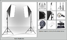

## Welcome to my GitHub Site

My applications and demos use a variety of different languages, which are:

* HTML
* CSS
* JavaScript
* PHP
* SQL
* Java
* Python

### Public Projects

| Project Name   |      Respositories      |      Demos      |
|----------|:-------------:|:------:|
| Image Switch |  [https://github.com/stellagurin/Image-Switch](https://github.com/stellagurin/Image-Switch) |  |
| Image Switch Without JavaScript |  [https://github.com/stellagurin/Image-Switch-Without-JavaScript](https://github.com/stellagurin/Image-Switch-Without-JavaScript) |  |
| Savings Calculator |  [https://github.com/stellagurin/Savings-Calculator](https://github.com/stellagurin/Savings-Calculator) |  |
| Marquee |  [https://github.com/stellagurin/Marquee](https://github.com/stellagurin/Marquee) |  |
| Switch Layout |  [https://github.com/stellagurin/Switch-Layout](https://github.com/stellagurin/Switch-Layout) |  |
| Ping Pong Game |  [https://github.com/stellagurin/Ping-Pong-Game](https://github.com/stellagurin/Ping-Pong-Game) |  |
